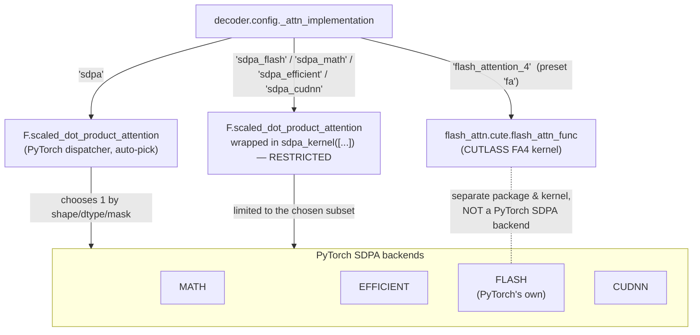

# Attention backends in this repo: presets, regimes, and why FA isn't winning

This explains the terms used when discussing `scripts/bench_speed.py` /
`scripts/bench_attention_kernels.py` results: presets, decode vs prefill,
SDPA backends, and why flash attention isn't beating SDPA on H100 for this
model.

## The basic operation: attention

Every transformer layer does the same core math: given a query vector and a
set of key/value vectors, compute how much the query should "attend to"
each key, and produce a weighted sum of the values. This is
`scaled_dot_product_attention` (SDPA) — `softmax(Q @ Kᵀ / sqrt(d)) @ V`.

There isn't one way to compute this on a GPU. Different *kernels*
(implementations of the same math) trade memory, parallelism, and
specialization differently. That's what this whole investigation is about:
which kernel is fastest, under which conditions.

## What a "preset" is in this codebase

`src/donut/accel/` defines small, independent optimizations. Each one is a
module with three functions:

- `apply_x(model)` — patch the model in place to use this optimization
- `revert_x(model)` — undo the patch
- `check_x(model)` — assert the optimization is actually active

A **preset** (`PRESETS` dict in `src/donut/accel/__init__.py`) is just a
named list of these steps applied together. `--backends` in
`scripts/bench_speed.py` picks which presets to benchmark. There are eight:

| preset | encoder kernel | decoder kernel |
|---|---|---|
| `baseline` | eager (plain PyTorch ops, nothing patched) | eager |
| `eager` | eager + cached attention-mask bias (`mask_cache.py`) | eager |
| `sdpa` | SDPA, auto-picked backend | SDPA, auto-picked backend |
| `sdpa_flash` | SDPA, auto-picked backend | SDPA, **strictly flash only** |
| `sdpa_math` | SDPA, auto-picked backend | SDPA, **strictly math only** |
| `sdpa_efficient` | SDPA, auto-picked backend | SDPA, **strictly efficient only** |
| `sdpa_cudnn` | SDPA, auto-picked backend | SDPA, **cuDNN preferred, efficient as fallback** |
| `fa` | SDPA, auto-picked backend | the actual FlashAttention-4 kernel |

The encoder (DonutSwin) has no flash-attention path at all — it's a legacy
class with its own hand-written attention, so all of these patch it the same
way (`encoder_sdpa.py`). The only thing that changes between the `sdpa*`
presets and `fa` is **which kernel the decoder uses**. That's intentional:
it isolates the decoder-kernel comparison from everything else — bracketing
plain `sdpa`'s auto-dispatch with every backend it could have individually
picked, to see exactly what it's doing differently.

`sdpa_flash`/`sdpa_math`/`sdpa_efficient` are strict, single-backend, no
fallback — the H100 kernel sweep below showed all three handle every shape
tested, including `kv_len=1` decode. `sdpa_cudnn` is the one exception (see
below) because cuDNN alone can't handle `kv_len=1` at all.

## SDPA backends: math / efficient / flash / cudnn

`F.scaled_dot_product_attention` (what `"sdpa"` and `"sdpa_cudnn"` both call
under the hood) isn't itself a kernel — it's a dispatcher. PyTorch picks one
of several backends based on input shape/dtype/mask:

- **math** — naive, literal `Q @ Kᵀ`, softmax, `@ V`. Always works, never
  fastest. The reference/fallback.
- **efficient** — memory-efficient attention (xformers-style), broader
  compatibility (e.g. handles arbitrary float attention masks, which the
  encoder needs for its window bias).
- **flash** — PyTorch's *own* built-in flash-attention kernel. Note: **this
  is a different implementation from the `flash-attn-4` package** used by
  the `"fa"` preset — same algorithm family, different code, can perform
  differently.
- **cudnn** — NVIDIA's cuDNN attention kernel. Only available on supported
  GPUs (H100 qualifies).

Normally PyTorch auto-picks one of these per call based on the shapes
involved, and you can't easily tell which one it picked.
`donut.accel.sdpa_backend(name)` (`src/donut/accel/sdpa_backend.py`) is a
context manager that *restricts* SDPA to exactly one named backend for
whatever call it wraps — `"math"`, `"efficient"`, `"flash"`, or `"cudnn"`.
`scripts/bench_attention_kernels.py` uses it this way deliberately, to
isolate one kernel at a time — including watching it fail when a backend
genuinely can't handle a shape (see below).

The `sdpa_cudnn` preset does *not* use that strict single-backend form.
cuDNN's SDPA backend can't handle `kv_len=1`, and `generate()`'s first
decode step always starts at `kv_len=1` before the cache grows — a hard
cudnn-only restriction crashes on the very first token of every
generation. Instead, `decoder_sdpa.py` calls
`sdpa_kernel([CUDNN_ATTENTION, EFFICIENT_ATTENTION], set_priority=True)`
directly: prefer cuDNN whenever it can handle the shape, fall through to
the efficient backend otherwise. Efficient was chosen as the fallback
because it had zero failures anywhere in the H100 sweep below, including
`kv_len=1`.

### Dispatch map: which flag routes to which kernel

The decoder's `config._attn_implementation` string is the switch. Three
distinct routes come out of it — and the `"fa"` preset's route does **not**
go through PyTorch's SDPA dispatcher at all:

Two things this makes concrete: (1) `"sdpa"` and every `"sdpa_*"` preset land
in the *same* four-backend pool — they only differ in whether PyTorch picks
freely or is restricted; (2) `"fa"` is a genuinely different kernel from a
different package (`flash-attn-4`), easy to confuse with the pool's `FLASH`
entry (PyTorch's own flash implementation) but not the same code. The
**encoder** never appears here: DonutSwin has no dispatch registry, so it's
patched directly to `F.scaled_dot_product_attention` (see
[encoder-optimizations.md](encoder-optimizations.md)) and always lands in the
pool too.

## decode vs prefill: why they're completely different workloads

This is the part that explains the confusing benchmark results.

- **prefill**: process a sequence of N tokens all at once (e.g. the first
  forward pass over a prompt). `query_len == kv_len == N`. This is what
  training and the "first pass" of generation typically look like — lots of
  parallel work per kernel call. Flash attention's tiled-block algorithm is
  *designed* for this: the bigger N is, the more it wins by avoiding
  materializing the full N×N attention matrix.
- **decode**: generate one new token at a time, reusing a KV cache of
  everything generated so far. `query_len == 1`, `kv_len` grows by one each
  step. There's no parallelism across query positions to exploit — each
  kernel call does one query attending to a (possibly long) cache — so a
  kernel's fixed launch/setup overhead dominates instead of its asymptotic
  algorithmic advantage.

**Donut's `generate()` call in this repo is decode-only.**
`make_decoder_input_ids` (`src/donut/synthetic.py`) builds a 1-token BOS
prompt, so with `use_cache=True`, every single step of `bench_generate`
(`src/donut/bench.py`) is a `query_len=1` attention call. There is no
prefill phase here at all — flash attention never gets to run in the regime
it's good at.

## What the H100 numbers actually showed

`scripts/bench_attention_kernels.py` benchmarks the real FA4 kernel
(`flash_attn.cute.flash_attn_func`, the exact function the `"fa"` preset
dispatches to) against SDPA's backends, sweeping `kv_len`, `batch_size`, and
`mode` (`decode` = query_len 1, `prefill` = query_len == kv_len, causal) —
fully decoupled from the Donut model, just raw tensors at the decoder's real
shape (16 heads, head_dim 64, bf16). A real run on H100 showed:

- **decode mode**: FA4 never wins a single row. At `kv_len=1, bs=1`:
  FA4 = 0.086 ms vs SDPA-flash = 0.04 ms, SDPA-efficient = 0.035 ms — FA4 is
  *2x slower*. Even at the largest decode shape tested (`kv_len=4096,
  bs=32`), `sdpa-cudnn` (0.202 ms) still beat FA4 (0.274 ms).
- **prefill mode**: FA4's advantage is real and large. At `kv_len=4096,
  bs=8`: FA4 = 0.77 ms vs `sdpa-math` = 47.1 ms (61x), vs `sdpa-efficient` =
  2.2 ms (3x).
- **`sdpa-cudnn` won or tied in almost every row**, including beating FA4 in
  FA4's own best case (`kv_len=4096, bs=32` prefill: cuDNN 2.43 ms vs
  FA4 2.90 ms).
- `sdpa-math` is the naive reference and behaves exactly as expected: fine
  at small shapes, catastrophic at large ones (OOM at `kv_len=4096, bs=32`
  prefill).

**Conclusion**: the `"fa"` preset isn't broken. FlashAttention's design
sweet spot (long-sequence, compute-bound, lots of query-side parallelism)
simply doesn't overlap with what Donut's `generate()` actually does
(decode-bound, `query_len=1` every step). Paying for FA4's kernel complexity
buys nothing in that regime, and can lose to simpler kernels on launch
overhead alone. cuDNN looked like the standout in this isolated sweep, which
is why it became a preset (`sdpa_cudnn`, `decoder_sdpa.py`) — see below for
whether that held up in the full model.

## Full-model confirmation (`bench_speed.py`, real image size)

This run predates `sdpa_flash`/`sdpa_math`/`sdpa_efficient` (added
afterward, once plain `sdpa` turned out to beat `sdpa_cudnn` below, to
bracket exactly what auto-dispatch is doing) — only `baseline`, `eager`,
`sdpa`, `sdpa_cudnn`, and `fa` existed at the time. Rerunning with all eight
presets on the H100 is the natural next step; results pending.

Running the actual model end-to-end (`naver-clova-ix/donut-base`, image
2560x1920, `max_new_tokens=32`) across batch sizes 1/2/4/8 confirms the
decode-regime finding directly: `fa`'s `generate()` latency ties or *loses*
to plain `eager` at bs=1-2 (gen ms: `fa`=145.4 vs `eager`=137.9 at bs=1;
145.3 vs 166.3 — fa barely ahead — at bs=2), only clearly pulling ahead once
bs≥4. Exactly the behavior originally reported on H100.

The bigger surprise: plain `sdpa` (untouched auto-dispatch) beat *every*
other preset, including the new `sdpa_cudnn`, at every batch size tested:

| bs | sdpa tok/s | sdpa_cudnn tok/s | fa tok/s |
|---|---|---|---|
| 1 | 274.2 | 263.0 | 220.2 |
| 2 | 465.4 | 444.1 | 387.1 |
| 4 | 729.8 | 722.7 | 625.5 |
| 8 | 1018.2 | 1000.0 | 900.0 |

`sdpa_cudnn` is consistently ~2-5% *slower* than unrestricted `sdpa`, despite
cuDNN winning lots of isolated-kernel rows in the sweep above. Most likely
explanation: real `generate()` mixes many different small `kv_len` values
(1→32) across the 32 decode steps, and `sdpa_cudnn`'s priority list
(`[CUDNN_ATTENTION, EFFICIENT_ATTENTION]`) excludes `FLASH_ATTENTION` —
which the unrestricted heuristic is free to pick per-call and which was
competitive at the smallest `kv_len` rows earlier. Restricting the
candidate set removed an option that was sometimes the right one.

**Practical takeaway**: use plain `"sdpa"` for this model on H100 — it's
both the simplest config and the fastest one measured. `sdpa_cudnn` is kept
as a preset (it's a legitimate, useful comparison point and the cudnn
backend genuinely wins in some regimes), but it isn't a clear win here.
`sdpa_flash`/`sdpa_math`/`sdpa_efficient` now exist specifically to settle
this properly — run all eight presets together and see which single backend
plain `sdpa`'s auto-dispatch is actually converging to, rather than guessing.

## Where to look for more

- `src/donut/accel/sdpa_backend.py` — the strict single-backend context
  manager, used by `bench_attention_kernels.py` for isolation.
- `src/donut/accel/decoder_sdpa.py` — `sdpa_cudnn` preset implementation
  (registers a custom `transformers` `AttentionInterface` entry that wraps
  the standard SDPA dispatch in a cudnn-preferred, efficient-fallback
  priority list).
- `scripts/bench_attention_kernels.py` — the isolated kernel-level sweep
  that produced the numbers above; rerun with different `--kv-lens
  --batch-sizes --modes` to probe other shapes.
- `scripts/bench_speed.py` — full-model benchmark across all five presets;
  `notebooks/bench.ipynb` visualizes its output.
- [encoder-optimizations.md](encoder-optimizations.md) — how the *encoder*
  patches (mask cache + SDPA) work, with diagrams.
