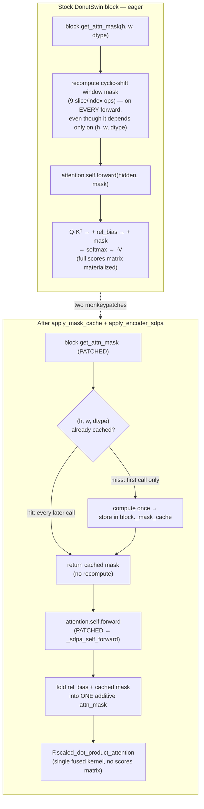
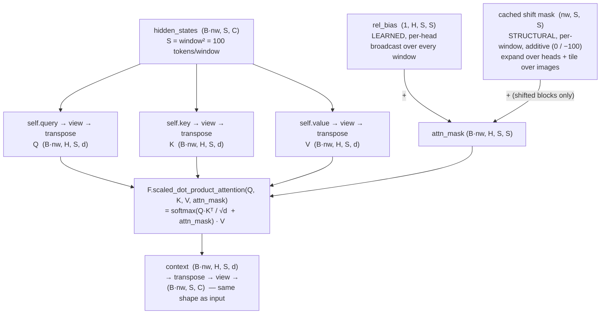
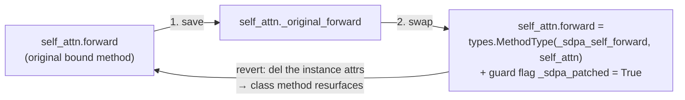

# Encoder-side optimizations: what we actually changed

The Donut encoder is a **DonutSwin** vision transformer. Its attention is
*windowed*: every token attends only inside a fixed `window_size² = 100`-token
window, plus a learned relative-position bias and — on shifted blocks — a
cyclic-shift mask. We made the encoder faster with **two surgical
monkeypatches** on each Swin block, applied in `src/donut/accel/`:

1. **`apply_mask_cache`** (`mask_cache.py`) — stop recomputing the cyclic-shift
   window mask on every forward pass.
2. **`apply_encoder_sdpa`** (`encoder_sdpa.py`) — replace the hand-written eager
   attention with a single fused `F.scaled_dot_product_attention` call.

They are related: the mask the first patch caches is exactly the additive bias
the second patch feeds into SDPA. Neither touches the model weights — both just
swap *methods* on the block, and both are fully reversible.

## The two patches, before vs after

The dashed link is the *cross-patch dependency*: `apply_encoder_sdpa` must run
**after** `apply_mask_cache`, because the SDPA forward consumes the cached mask
as its `attn_mask`. (`PRESETS` in `accel/__init__.py` always orders them
`MASK_CACHE → ENCODER_SDPA`.)

## Inside the SDPA attention, step by step

This is the part worth understanding in detail: what `_sdpa_self_forward`
(`encoder_sdpa.py`) actually computes, and *why* a single fused SDPA call can
stand in for DonutSwin's hand-written attention.

### How we got here (stock Swin, before our function runs)

The encoder doesn't run attention over the whole image at once. Stock
DonutSwin (not our code) does this upstream, per stage:

1. Patch-embed the image into a feature map.
2. On **shifted** blocks, cyclically roll the feature map by half a window.
3. Partition the map into non-overlapping `window_size × window_size` windows.
4. Flatten every window into the **leading dimension**.

So by the time our `_sdpa_self_forward` is called, `hidden_states` is shaped
**`(B·nw, S, C)`**:

- `B·nw` = images × windows — the leading "batch" dim is *windows*, not the
  image batch. Each row is one independent window.
- `S` = `window_size²` = **100** tokens (the whole sequence a token can attend
  to — attention never crosses windows).
- `C` = the stage's hidden size.

Keep that in mind: everything below runs **per window, per head**, on a tiny
`100 × 100` attention.

### What our function computes

Line by line:

1. **Project Q, K, V.** Each linear maps `(B·nw, S, C) → (B·nw, S, C)`, then
   `view` splits `C = H·d` into `H` heads of width `d` and `transpose` puts
   heads next to the batch: `(B·nw, H, S, d)`.
2. **Relative-position bias** (`rel_bias`, learned). DonutSwin doesn't use plain
   positional encodings — it adds a learned bias to the attention *scores*
   based on each key's position **relative** to the query. The
   `relative_position_bias_table` is gathered by `relative_position_index` into
   `(1, H, S, S)`: one `100×100` bias matrix per head, identical for every
   window (hence the broadcastable leading `1`).
3. **Shift mask** (`attention_mask`, structural — *shifted blocks only*). After
   the cyclic roll, some tokens that ended up in the same window are not
   actually spatial neighbours and must not attend to each other. The cached
   mask (from `mask_cache.py`) is `(nw, S, S)`, additive: `0` where attention
   is allowed, `−100` where it must be killed (≈ `−∞` after softmax). It's
   `expand`-ed over heads and tiled over images to line up with the batch.
4. **Fold both into one `attn_mask`**: `attn_mask = rel_bias + shift_mask`,
   shape `(B·nw, H, S, S)`.
5. **One SDPA call** does the actual attention:
   `softmax(Q·Kᵀ / √d  +  attn_mask) · V`.
6. **Unwind**: `(B·nw, H, S, d) → transpose → view → (B·nw, S, C)`, back to the
   input shape for the rest of the block.

### Why SDPA's `attn_mask` argument is the whole trick

Vanilla attention is `softmax(Q·Kᵀ / √d) · V`. Swin attention is **not**
vanilla — it inserts **two additive terms before the softmax**: a learned
per-head relative-position bias *and* a per-window structural shift mask.

`F.scaled_dot_product_attention`'s `attn_mask` argument is defined as exactly
*"an arbitrary float tensor added to the scaled scores `Q·Kᵀ/√d` before the
softmax."* That is precisely the slot both Swin biases need. So we **sum the two
biases into one tensor** and hand it over as `attn_mask` — and a single fused
kernel computes the entire biased-windowed attention. Without that argument
we'd have to materialize the scores ourselves to add the biases (what the eager
path does); with it, the whole thing collapses to one call. *That* is why the
hand-written block can be replaced at all.

(One consequence: an *additive float* `attn_mask` is also why PyTorch usually
can't pick its Flash backend for the encoder — see
[attention-backends.md](attention-backends.md) — and falls to the
Efficient/Math kernel, which is fine here.)

### A concrete window (donut-base, stage 0, 1280×960)

Patch-embed (`patch_size 4`) turns `1280×960` into a `320×240` feature map;
stage 0 tiles it into `32 × 24 = 768` windows. With one image (`B=1`):

- `hidden_states`: `(768, 100, 128)` → `B·nw = 768`, `S = 100`, `C = 128`.
- Stage 0 has `H = 4` heads, so `d = 128 / 4 = 32`.
- `Q, K, V`: each `(768, 4, 100, 32)`.
- `rel_bias`: `(1, 4, 100, 100)`; shift mask `(768, 100, 100)` → `(768, 4, 100, 100)`.
- The one SDPA call runs `768 × 4 = 3072` independent `100×100` attentions in
  parallel — every window, every head — and returns `(768, 4, 100, 32)`.

## How a patch is applied — and reverted

Both patches use the same idempotent, reversible method-swap recipe (shown here
for the SDPA forward; the mask cache does the identical thing to
`block.get_attn_mask`):

- **Idempotent** — the guard flag (`_sdpa_patched` / `_mask_cache_applied`)
  makes re-applying a no-op, so layering presets that share a step is safe.
- **Reversible** — `revert_encoder_sdpa` / `revert_mask_cache` just delete the
  per-instance attributes; the original class method shadows back into place,
  restoring bit-identical behavior. This is what makes a fair "eager vs
  accelerated" comparison possible on a single loaded model
  (`donut.audit.eager_encoder`).

## Why each change is safe

- **Mask cache is bit-exact.** The cyclic-shift mask is a pure function of
  `(height, width, dtype)` — caching only removes redundant recomputation, it
  changes no values. Verified by `tests/test_numerical.py::test_mask_cache_bit_exact`
  and `test_cached_mask_values_match_reference`.
- **SDPA stays faithful.** It computes the same biased-softmax attention, just
  fused; small bf16 numerical drift only, with no change to decoded tokens
  (`tests/test_numerical.py::test_encoder_sdpa_close_to_eager`). When
  `output_attentions=True` is requested (SDPA can't return weights), the patch
  transparently falls back to the original eager forward.

## Code

- `src/donut/accel/mask_cache.py` — `apply_mask_cache` / `revert_mask_cache` /
  `check_mask_cache`.
- `src/donut/accel/encoder_sdpa.py` — `apply_encoder_sdpa` and the
  `_sdpa_self_forward` replacement.
- `src/donut/accel/__init__.py` — how the two steps compose into the `eager`,
  `sdpa`, and `fa` presets.
- For the *decoder*-side kernel choices and the SDPA-backend dispatch map, see
  [attention-backends.md](attention-backends.md).
